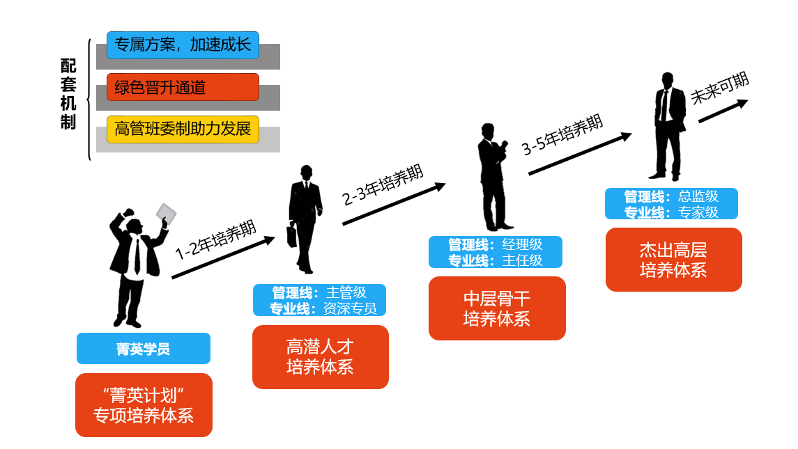

# 理想中的职业规划

1. 2年测试、3年组长、四年主管、五年测试经理，买车买房、迎娶白富美亦或者是嫁入豪门…
2. 我想绝大多数人应该都做过这样的梦。
3. 但现实就是现实，有的甚至初入职场，因为各种原因熬不住乃至转行另寻他路。
4. 很无奈，我这写的几篇破文章没办法帮你买车买房做到人生巅峰，只能做到一技傍身，混口饭吃。
5. 如果你头铁，非要钻这行，那就再尝试往下看看软件测试从业者可能的三到五年的职业规划：
   * 短期目标（1-2年）：大多数时候都是在专注于技能提升，掌握多种测试方法和技术，同时开始建立自己的专业网络，为未来的职业发展打下坚实的基础。
   * 中期目标（2-4年）：尝试寻求更高级别的职位，如测试组长或主管，开始积累团队管理经验，并在专业领域内建立自己的影响力。
   * 长期目标（4-5年）：瞄准测试经理或更高层次的职位，如质量保证总监，不仅要精通技术，还要具备战略规划和业务洞察力。

